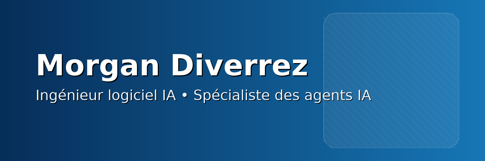

<!-- Banner -->
<!-- Après avoir ajouté banner_morgan_github.png à la racine du repo, décommente l'image ci-dessous -->
 

# 👋 Bonjour, je suis **Morgan Diverrez**

**Ingénieur logiciel IA · Spécialiste des agents IA**  
CTO & co-fondateur — [Nijal AI](https://nijal.ai)

---

## 🧭 À propos
- 🤖 Conception d’**agents IA** robustes (workflow, tool use, exécution)  
- 📦 Intégration **RAG**, **LangGraph/LangChain**, MCP  
- ☁️ Déploiement **Docker**, VM, Azure, Clever Cloud  
- 🧑‍🏫 Enseignement : **Python, POO, Git, Docker, Bases de données**

---

## 🧰 Stack
**Langages** : Python · TypeScript · JavaScript · PHP · Kotlin
**Frameworks / Outils** : FastAPI · React/Next.js · LangGraph · LangChain · Docker · Simfony · PostgreSQL/Vector · Redis

---

## 📬 Contact
- LinkedIn : [morgan-diverrez](https://www.linkedin.com/in/morgan-diverrez/)
- Malt : [morgandiverrez](https://www.malt.fr/profile/morgandiverrez)
- Site : [nijal.ai](https://nijal.ai)

> _Objectif : créer et déployer des IA utiles, sécurisées et maintenables._
